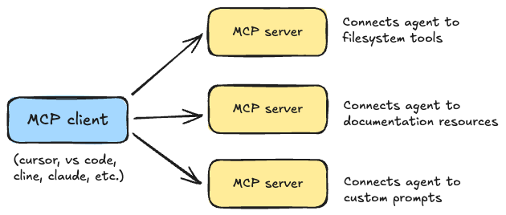

# MCP Servers over Streamable HTTP (Step by Step)

## What is MCP?

MCP (Model Context Protocol) is a protocol designed for communication between LLMs and tools or resources. Remember that an AI agent can usually call tools to complete tasks. In most frameworks, the tools are hosted in the same codebase as the AI assistant. MCP allows you to separate the tools (and other resources) from the AI assistant. The tools are thus hosted on another application called the MCP server, which responds to requests from the AI assistant.

A good way to think of these tools and resources is as a set of functions hosted somewhere other than your AI assistant. So when your AI assistant needs to perform a task, it can call one of these functions. It sends a request to the MCP server, which then executes the function and returns the result back to your AI assistant. Kind of like an external toolbox (or a microservice) that your AI assistant can use. 

And you can have multiple MCP servers connected to your appliction. 




MCP provides a common language between the AI assistant and these tools. This means that once your AI assistant is set up to use MCP, it can interact with any tool or resource that supports the protocol without needing to configure it for each specific tool. For example, if the team behind Supabase decides to create an MCP server for their tools, your AI assistant can just connect to it and start using the Supabase tools without any additional configuration.

In summary, with MCP, your assistant will use the tools in the MCP server as if they were part of its own codebase, but they are actually hosted elsewhere. Kind of like a microrservice architecture for AI assistants. And once your AI assistant is set up to use MCP, it can interact with any tool or resource that supports the protocol. That's why you ofen hear agent developers announce that their agent is "MCP-compatible" or "MCP-ready". It means that the agent can now use any tool or resource that supports the MCP protocol, which makes it more flexible and powerful. 

## Your first MCP server

Let's create a simple MCP server that exposes a few tools and resources. We'll use the `mcp` library to create the server and expose the tools and resources over HTTP (more about this later).

We'll start by creating a simple server that exposes a tool to get the weather of a city. We will be doing this example in Python, but you can use any language that supports MCP. 

### Setting up the project

First, I really recommend that you [install `uv`](https://github.com/astral-sh/uv), arguably the best package manager for Python as of today. But you can also use `pip` if you prefer. [Here](https://docs.astral.sh/uv/getting-started/installation/) are the detailed instructions of how to install `uv`. Or you can just run the following command to install it:

```bash
# on macOS or Linux
curl -LsSf https://astral.sh/uv/install.sh | sh

# on Windows
powershell -ExecutionPolicy ByPass -c "irm https://astral.sh/uv/install.ps1 | iex"
```

Once you have `uv` installed, you can create a new project and install the `mcp` library:

```bash
uv init my-mcp-server
cd my-mcp-server
```

Now, let's intialize a virtual environment:

```bash
uv venv
source .venv/bin/activate  # on macOS/Linux/WSL
.venv\Scripts\activate  # on Windows
```

And now we can install the `mcp` library.
```
uv add mcp
```

We will also use Tavilly API to create a tool that will allow our agent to search the internet. 
```
uv add tavily-python
```

### Creating the MCP server

Now that we have the `mcp` library installed, we can create our first MCP server. We'll create a file called `server.py` where we will define our MCP server and the tools and resources it exposes.

```python
# server.py

from mcp.server.fastmcp import FastMCP
from tavily import TavilyClient

# Initialize Tavily client
tavily_client = TavilyClient("TAVILY_API_KEY")

# Create an MCP server
mcp = FastMCP("demo", host="127.0.0.1", port=8000)

# Add a tool that uses Tavily
@mcp.tool()
def web_search(query: str) -> Dict:
    """
    Use this tool to search the web for information.

    Args:
        query: The search query.

    Returns:
        The search results.
    """
    try:
        response = tavily_client.search(query)
        return response["results"]
    except:
        return "No results found"

# Run the server
if __name__ == "__main__":
    mcp.run(transport="streamable-http")
```

And that's it! You've created your first MCP server. You can already run it by doing the following:

```bash
uv run server.py # if using uv

python server.py # if not using uv
```

This code creates an MCP server called "demo" and adds a tool called `web_search` that takes a search query as input and returns the results of the search. The server is set to run using the standard input/output (stdio) transport protocol.

## How to run the MCP server?

To run the MCP server, you will need an *MCP client*. This is an app (an agent) that is compatible with the MCP protocol and can communicate with the MCP server. You can find a list of some of the popular applications that support MCP on the [MCP website](https://modelcontextprotocol.io/clients).

For this tutorial, we will use Cursor, which support tool usage through MCP for its coding assistant. You can download Cursor from [here](https://cursor.com/). 

Once you have Cursor installed, you can add a new MCP server by going to "Chat Settings" and then "MCP Servers". Click on "Add MCP Server" and enter the following details:

```json
mcpServers: {
  "tavily": {
    "url": "http://localhost:8000/mcp/"
  }
}
```

For some strange reason, you do have to add that final `/` to the URL. Otherwise, your server will not recognize the endpoint. 


Now go back to your chat settings and disable/enable the MCP server to make sure the changes are applied. You should see that the server now has one tool available: `web_search`.

## How to debug the MCP server?

Debugging an MCP server can be a bit tricky, as it is not a standard web server and you cannot just run it and access it through a web browser. 

However, Anthropic provides a tool called the MCP inspector that allows you to inspect and debug your MCP server. The MCP inspector is a web interface that allows you to interact with your MCP server and see the requests and responses in real time. 

To run the MCP inspector, you can use either `uv` or `npx`. If you have `uv` installed, you can run the inspector with the following command:

```bash
# you will need to have the `mcp[cli]` extra installed
uv add 'mcp[cli]'

# then you can run the inspector
uv run mcp dev server.py # your server file
```

If you want to use `npx`, you can run the following command:

```bash
npx @modelcontextprotocol/inspector python server.py
```

You can now open your web browser and go to `http://localhost:6274` to access the MCP inspector. Note that if you are runnning it through the HTTP transport, you may need to access this with an MCP proxy token that is instantly generated when you run the inspector. Just check your terminal for the token, which will appear as a URL-param like this:

```
http://localhost:6274/?MCP_PROXY_AUTH_TOKEN=your_token_here
```

You can now interact with your MCP server through the inspector. You can send requests to the server and see the responses in real time. This is a great way to debug your MCP server and see what is happening behind the scenes.

**Important**: If you are using HTTP transport, for some reason, the MCP inspector automatically tries to connect to the MCP server at `http://127.0.1:8000/sse`, which is not the correct URL for our server as of the latest version. To connect the MCP inspector to our server, we need to specify the correct URL, which will be at `/mcp`. We will later see how to change this default URL if you want to use a different path or port.

## Mount your MCP Server to a FastAPI server 

There are two ways to set up the host and path for the MCP server. The first way is to pass the `host` and `path` parameters to the `FastMCP` constructor, as we did in the previous example. This will allow you to specify the address and path where the MCP server will listen for HTTP requests.

```python
# server.py

from mcp.server.fastmcp import FastMCP

# Create an MCP server
mcp = FastMCP("demo", host="127.0.0.1", port=8000)

# Add a simple tool
# [...]

# Run the server
if __name__ == "__main__":
    mcp.run(transport="streamable-http")
```

The second way is to mount the MCP server on a FastAPI application. This is useful if you want to have more control over the HTTP server and its configuration. 

```python 
# server.py

from mcp.server.fastmcp import FastMCP
from fastapi import FastAPI

# Create an MCP server
mcp = FastMCP("demo")

# Create a FastAPI application
app = FastAPI(title="demo",lifespan=lambda app: mcp.session_manager.run())
app.mount("/search-server", mcp.streamable_http_app())

if __name__ == "__main__":
    # used argparse to get the host and port parameters in args
    uvicorn.run(app, host=args.host, port=args.port, log_level="info")
```

This code creates a FastAPI application and mounts the MCP server on the `/my-server` path. You can then run this application with `uvicorn` or any other ASGI server.

```bash
uv run server.py --mode fastapi --host 127.0.0.1 --port 8000 
```

This will start the FastAPI application and the MCP server will be available at `http://127.0.0.1:8000/my-server/mcp/`. For example, to connect to the `echo` tool, you would use the URL `http://127.0.0.1:8000/my-server/echo/mcp/`.

Note: Remember that you have to add the `/` to the end of the path for it to work with your MCP client. 


You can then configure your MCP client (like Cursor) to connect to this URL.

## Mounting multiple MCP servers in a FastAPI application

If you want to mount multiple MCP servers in a FastAPI application, you can do so by creating multiple instances of `FastMCP` and mounting them on different paths.

```python
# echo.py
from mcp.server.fastmcp import FastMCP

mcp = FastMCP(name="EchoServer", stateless_http=True)


@mcp.tool(description="A simple echo tool")
def echo(message: str) -> str:
    return f"Echo: {message}"
```

```python
# math.py
from mcp.server.fastmcp import FastMCP

mcp = FastMCP(name="MathServer", stateless_http=True)


@mcp.tool(description="A simple add tool")
def add_two(n: int) -> int:
    return n + 2
```

```python
# main.py
import contextlib
from fastapi import FastAPI
from mcp.echo import echo
from mcp.math import math


# Create a combined lifespan to manage both session managers
@contextlib.asynccontextmanager
async def lifespan(app: FastAPI):
    async with contextlib.AsyncExitStack() as stack:
        await stack.enter_async_context(echo.mcp.session_manager.run())
        await stack.enter_async_context(math.mcp.session_manager.run())
        yield


app = FastAPI(lifespan=lifespan)
app.mount("/echo", echo.mcp.streamable_http_app())
app.mount("/math", math.mcp.streamable_http_app())
```

This code creates two MCP servers, one for the echo tool and another for the math tool. It then mounts both servers on different paths (`/echo` and `/math`) in a FastAPI application.

Source: [Python SDK Documentation](https://github.com/modelcontextprotocol/python-sdk?tab=readme-ov-file#streamable-http-transport)

## References
https://heeki.medium.com/building-an-mcp-server-as-an-api-developer-cfc162d06a83